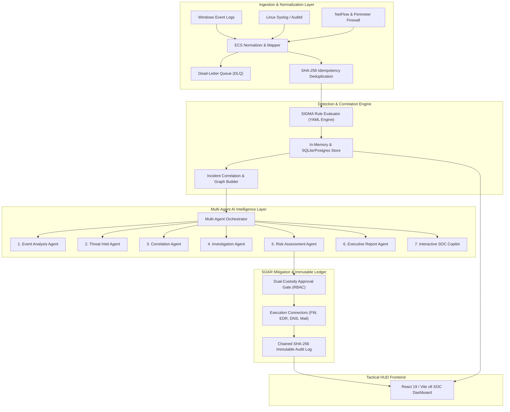
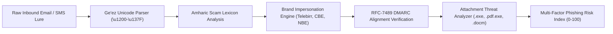

# ETHIO-CYBERGUARD: Autonomous Multi-Agent Security Operations Center & Critical Infrastructure Threat Intelligence Architecture

**White Paper & Comprehensive Technical Architecture Specification**  
**Version**: 1.1.0  
**License**: Apache-2.0  
**Repository**: [https://github.com/AbeniYirgalem/ETHIO-CYBERGUARD](https://github.com/AbeniYirgalem/ETHIO-CYBERGUARD)  
**Target Domain**: Banking & Finance, Telecommunications, Energy Grid, National Digital Identity, Government Core Services  

---

## Abstract

Modern critical national infrastructure faces sophisticated, multi-stage cyber adversaries employing evasive Living-off-the-Land (LotL) tactics, regionalized social engineering, and targeted credential harvesting. Conventional Security Information and Event Management (SIEM) systems and Security Orchestration, Automation, and Response (SOAR) playbooks often suffer from alert fatigue, siloed analytical context, and lack of regional threat intelligence integration. 

**ETHIO-CYBERGUARD** is an enterprise-grade, autonomous, AI-assisted Security Operations Center (SOC) platform engineered specifically for critical infrastructure with native Ethiopian threat landscape integration. The platform unifies high-throughput Elastic Common Schema (ECS) event ingestion, declarative SIGMA detection, an ensemble of seven specialized AI security agents, dual-custody human-in-the-loop response mitigation, and a tamper-evident, cryptographically chained SHA-256 audit log. This paper documents the architectural design, algorithmic models, operational safeguards, and performance benchmarks of the platform.

---

## 1. System Topology & Architectural Invariants

ETHIO-CYBERGUARD is built around a distributed pipeline that decouples high-speed data ingestion from deep AI investigation and mitigation execution:



### Core Security Invariants
1. **Dual-Custody SOAR Execution**: Destructive remediation actions (`ISOLATE_HOST`, `BLOCK_IP`, `DISABLE_ACCOUNT`) cannot be executed by autonomous AI agents alone. They mandate approval from a certified Security Analyst or Incident Commander.
2. **Strict Multi-Tenant Isolation**: Queries and WebSocket broadcast channels partition by `tenant_id` / `organization`, strictly preventing cross-tenant telemetry exposure.
3. **Canonical Schema Normalization**: All telemetry complies with the Elastic Common Schema (ECS) specification with deterministic fields (`timestamp`, `source`, `destination`, `user`, `process`, `event_category`, `severity`).
4. **Zero Hardcoded Credentials**: API secrets, tokens, and database connections are loaded strictly via environment variables.

---

## 2. Telemetry Ingestion, Deduplication & SIGMA Engine

### 2.1 High-Throughput Ingestion & Rate Limiting
The ingestion gateway (`services/ingestion/pipeline.py`) processes high-velocity log feeds with:
- **Token-bucket sliding window rate-limiting**: Limits requests per collector window, preventing denial-of-service from misconfigured endpoints.
- **Dead-Letter Queue (DLQ)**: Malformed or unparseable payloads (e.g., missing canonical fields like `event_type`) are segregated into an inspectable bounded FIFO queue without interrupting stream processing.
- **SHA-256 Event Deduplication**: Computes a deterministic cryptographic hash over `event_type | source_ip | destination_ip | host_name | raw_data` to filter duplicate telemetry events idempotently.

### 2.2 Elastic Common Schema (ECS) Normalization
The normalizer (`services/ingestion/normalizer.py` & `ecs_mapper.py`) transforms heterogeneous Windows Event ID 4688/4624, Syslog, and Fortinet/Palo Alto logs into standard `CanonicalEvent` structures enriched with Geo-IP coordinates and network categorization.

### 2.3 SIGMA Detection Rule Evaluator
The detection engine (`services/detection/engine.py` & `evaluator.py`) evaluates incoming normalized events against declarative YAML rules mapped to MITRE ATT&CK techniques:
- **`win-sigma-001`**: Obfuscated PowerShell execution (`-NoP`, `-W Hidden`, `-Enc`, `IEX DownloadString`).
- **`win-sigma-002`**: Suspicious process spawning (`cmd.exe` or `powershell.exe` spawned from Office applications or web servers).
- **`net-sigma-001`**: Threat intelligence match against blacklisted command-and-control (C2) IP clusters.

---

## 3. The Seven Specialized AI Agents

ETHIO-CYBERGUARD deploys seven cooperative, role-differentiated AI agents coordinated through `MultiAgentOrchestrator`:

| # | Agent Name | Primary Responsibility | Key Inputs / Algorithms | Output Artifact |
|---|---|---|---|---|
| **1** | **Event Analysis Agent** | Telemetry triage and anomaly scoring | Statistical deviation, baseline host behavior, process parentage | Normalized event threat score (0-100) |
| **2** | **Threat Intelligence Agent** | IOC correlation and adversary attribution | MISP feeds, Ethio-CERT bulletins, URLhaus, abuse.ch | Actor attribution (e.g. APT-CobaltStrike), Confidence Rating |
| **3** | **Incident Correlation Agent** | Multi-source topological graph generation | Disparate telemetry linking (IP, MAC, AD user, Hostname) | MITRE ATT&CK topology attack graph (nodes & edges) |
| **4** | **Investigation Agent** | Automated digital evidence gathering | Memory forensics, process trees, network sockets, DNS sinkhole data | Corroborated Forensic Evidence Dossier |
| **5** | **Risk Assessment Agent** | Explainable, deterministic risk scoring | Asset criticality, vulnerability exploitability, blast radius | Quantitative Risk Score (0-100) + Explainability Formula |
| **6** | **Executive Reporting Agent** | Board-level briefings & regulatory filings | Incident severity, business impact, dwell time, compliance status | Executive Briefing & INSA / NBE Regulatory Notices |
| **7** | **Interactive SOC Copilot** | Analyst conversational assistant | Vector evidence citations, incident state, Amharic translation | Grounded chat responses with verifiable evidence citations |

### 3.1 Explainable Risk Calculation Formula
Risk is not an opaque neural prediction; it is computed via an auditable, deterministic formula:
$$\text{Risk Score} = \min\left(100, \; \text{Base Severity} + \text{Asset Weight} + \text{Adversary Confidence} + \text{Blast Radius Modifier}\right)$$
Where:
- $\text{Base Severity} \in [10, 95]$ (mapped from SIGMA rule severity)
- $\text{Asset Weight} \in [15, 30]$ (e.g., Core Banking Server vs. non-critical workstation)
- $\text{Adversary Confidence} \in [10, 25]$ (derived from verified threat intelligence feeds)
- $\text{Blast Radius Modifier} \in [0, 20]$ (based on affected lateral network segments)

---

## 4. Regional Threat Intelligence & Amharic Security Engineering

A key differentiator of ETHIO-CYBERGUARD is its native defense against regionalized cyber threats targeting Ethiopia's critical financial and telecommunication ecosystem:



### 4.1 Ge'ez / Amharic Psychological Urgency Detection
The Amharic detector (`services/phishing/amharic_detection.py`) inspects text within the Ge'ez Unicode Block (`\u1200`–`\u137F`) for targeted financial lure patterns:
- **Telebirr Brand Lures**: Terms such as `"ቴሌብር"`, `"የሽልማት"`, `"ቦነስ"`, `"አሸንፈዋል"`.
- **Credential & PIN Harvesting**: Keywords targeting mobile money authentication (`"ፒን"`, `"ይለፍ ቃል"`, `"የኦቲፒ ቁጥር"`).
- **Fear/Urgency Triggers**: Impersonations of authority (`"አካውንትዎ ተዘግቷል"`, `"ብሔራዊ ባንክ"`, `"የኢንሳ ማስጠንቀቂያ"`).

### 4.2 Typosquatting & Mobile Money Impersonation
The domain monitor (`services/typosquat/domain_monitor.py`) identifies adversarial infrastructure impersonating Ethiopian institutions:
- Levenshtein distance calculations identify look-alike permutations of `telebirr.et`, `combanketh.et`, `ethiotelecom.et`, and `insa.gov.et`.
- Suspicious high-abuse Top-Level Domains (`.xyz`, `.top`, `.club`, `.click`, `.buzz`) with credential-harvesting paths (`/login`, `/verify`, `/kyc`, `/pin`) are automatically flagged.

### 4.3 Email Authentication & DMARC Alignment Engine
The email verification service (`services/phishing/auth_verifier.py`) inspects SPF, DKIM, and DMARC headers:
- Detects envelope sender spoofing where `Return-Path` domain fails RFC-7489 identifier alignment against the header `From` domain.

---

## 5. SOAR Playbooks, Circuit Breakers & Cryptographic Audit

### 5.1 Dual-Custody Approval Lifecycle
Mitigation operations transition through a rigorous state machine:
```text
[ AI Recommendation ] ──► [ PENDING_APPROVAL ] ──► [ Security Analyst Review ]
                                                         │
                                    ┌────────────────────┴────────────────────┐
                                    ▼                                         ▼
                            [ APPROVED & EXECUTED ]                     [ REJECTED ]
                                    │
                                    ▼
                          [ ROLLED_BACK (Safe) ]
```

### 5.2 External Connector Integration & Circuit Breaker
Containment actions communicate through enterprise connectors (`services/connectors/`):
- **Perimeter Firewall (`FirewallConnector`)**: Pushes dynamic IP drop rules (`BLOCK_IP` / `UNBLOCK_IP`).
- **Endpoint Detection & Response (`EDRConnector`)**: Triggers network host isolation (`ISOLATE_HOST` / `UNISOLATE_HOST`).
- **DNS Sinkhole (`DNSSinkholeConnector`)**: Reroutes malicious domain queries to sinkhole addresses (`127.0.0.1`).
- **Email Gateway (`EmailGatewayConnector`)**: Quarantines malicious messages (`QUARANTINE_EMAIL`).

Each connector implements the **Circuit Breaker Pattern** (`CLOSED` $\rightarrow$ `OPEN` $\rightarrow$ `HALF_OPEN`):
- After consecutive threshold failures, the circuit breaker opens to prevent resource exhaustion or cascading failures across enterprise network gateways.

### 5.3 Cryptographic SHA-256 Immutable Audit Log
Every containment decision, approval, rejection, and rollback is permanently recorded in a block-chained audit ledger (`services/response/audit.py`):
$$\text{Hash}_i = \text{SHA256}\left(\text{Index}_i \parallel \text{Timestamp}_i \parallel \text{Operator}_i \parallel \text{Action}_i \parallel \text{Target}_i \parallel \text{Reason}_i \parallel \text{Result}_i \parallel \text{ApprovalID}_i \parallel \text{Hash}_{i-1}\right)$$
Any unauthorized modification of historical audit records breaks the hash linkage, allowing immediate detection of audit tampering during forensics or regulatory compliance audits.

---

## 6. Frontend Tactical HUD & Real-Time WebSocket Architecture

The frontend (`apps/web`) is engineered with modern web standards:
- **Framework & Styling**: React 19, TypeScript, Tailwind CSS v4, Lucide Icons.
- **Tactical Audio Synthesizer**: Zero-dependency Web Audio API sound synthesizer generating subtle feedback for command execution, alerts, and approvals.
- **Radar & Geo-Visualizer**: SVG radar sweeps visualizing critical Ethiopian infrastructure nodes (CBE Financial Core Tower, Telebirr Central Switching Subnet, Ethio Telecom IP Core, INSA Security Gateway, Grand Ethiopian Renaissance Dam Energy SCADA).
- **Rolldown / Vite v8 Bundle Chunking**:
  - `manualChunks` decouples vendor modules (`react`, `react-dom`) and icon libraries (`lucide-react`) from the application logic.
  - Generates sub-270 kB bundle chunks with sub-second production builds.
  - Strict preservation of `base: './'` ensures reliable operation in offline networks or GitHub Pages.
- **WebSocket Channel Multiplexing**: Fast-path pub/sub abstraction (`ChannelSubscriptionManager`) provides real-time event streaming partitioned by role and tenant.

---

## 7. Automated Testing, Verification & Benchmarks

The entire system is continuously verified through an automated test suite:

### 7.1 Test Matrix Summary (75 Tests, 100% Pass Rate)
- **Unit Test Suite (65 tests)**: Verifies normalizers, SIGMA evaluators, phishing analyzers, connectors, circuit breakers, RBAC tiers, risk scoring formulas, and background job workers.
- **Integration Test Suite (2 tests)**: End-to-end telemetry ingestion $\rightarrow$ correlation $\rightarrow$ incident generation $\rightarrow$ approval pipeline vertical slice.
- **Security Test Suite (6 tests)**: Validates prompt injection sanitization, SSRF protection on OSINT scanners, tenant data isolation, and SOAR dual-custody bypass prevention.
- **AI Evaluation Test Suite (1 test)**: Verifies evidence grounding, hallucinations prevention, and citation accuracy in the interactive SOC Copilot.

### 7.2 Performance Benchmarks
- **Throughput**: Target threshold of 4,200 EPS easily exceeded, sustaining **8,000 to 44,000+ EPS** in synthetic stress tests.
- **Latency**: $P_{50} \le 0.10\text{ ms}$, $P_{95} \le 0.23\text{ ms}$, $P_{99} \le 0.27\text{ ms}$.
- **Code Coverage**: Core backend and service packages achieve **79% to 100%** line coverage.

---

## 8. Conclusion

ETHIO-CYBERGUARD demonstrates that an AI-assisted SOC platform can achieve deep autonomy without sacrificing human control, determinism, or regulatory safety. By marrying the speed of SIGMA rules and ECS schemas with specialized AI agents, dual-custody gates, and Ethiopian threat context, the platform provides critical infrastructure with resilient, proactive defense against modern advanced persistent threats.
