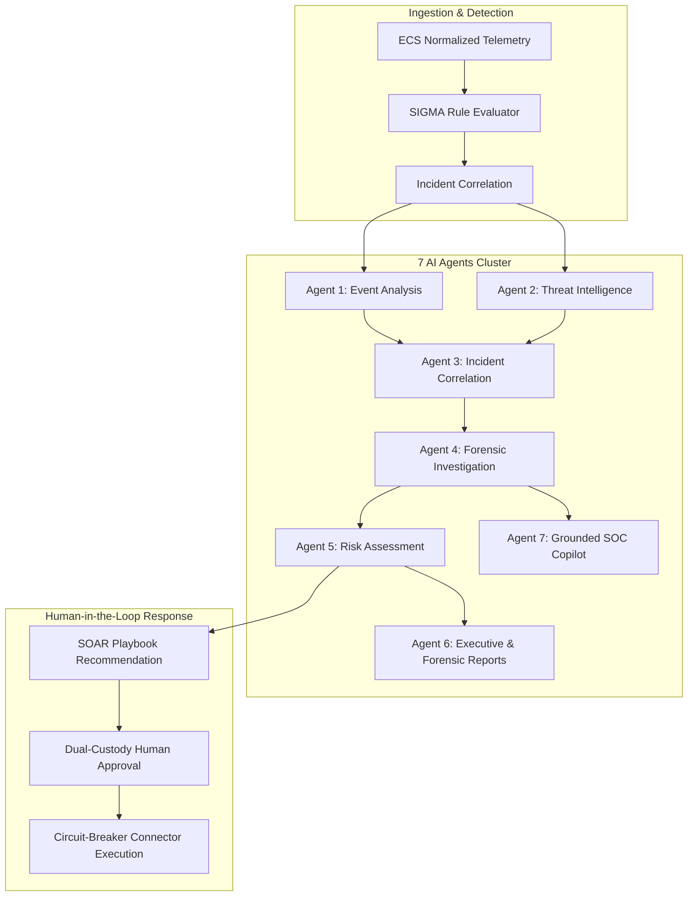

# 🤖 ETHIO-CYBERGUARD Multi-Agent AI Architecture

**Version**: 1.1.0  
**Cluster Architecture**: 7-Agent Directed Acyclic Graph (DAG)  
**Safety & Grounding**: Schema-Constrained Pydantic v2 Models, Zero-Hallucination Grounding, Heuristic Fallbacks  

---

## 1. Multi-Agent System Overview

ETHIO-CYBERGUARD rejects monolithic, unconstrained conversational chatbots in critical cybersecurity operations. Instead, it deploys a cluster of seven specialized AI agents operating under deterministic coordination. Each agent is bound to a single analytical domain, consuming Elastic Common Schema (ECS) telemetry and emitting strictly validated JSON objects.



---

## 2. In-Depth Agent Specifications

### Agent 1: Security Event Analysis Agent
- **Objective**: Conducts sub-second inspection of raw process execution arguments, registry changes, and memory invocations.
- **Specializations**:
  - Base64 payload deobfuscation (`-enc`, `FromBase64String`).
  - Living-off-the-Land (LotL) binary abuse detection (`certutil -urlcache`, `mshta.exe`, `wmic.exe`, `rundll32.exe`).
  - AMSI / ETW bypass patterns.
- **Output Schema**:
  ```json
  {
    "is_malicious": true,
    "confidence": 0.94,
    "mitre_techniques": ["T1059.001", "T1027"],
    "analysis_summary": "Deobfuscated PowerShell script executes memory-only AMSI patch followed by encrypted web download.",
    "suspicious_indicators": ["-enc SQBFAFgA", "AmsiUtils", "VirtualProtect"]
  }
  ```

### Agent 2: Threat Intelligence Agent
- **Objective**: Cross-references observed entities against verified threat feeds and national repositories.
- **Intelligence Repositories**:
  - **Ethio-CERT / INSA Feeds**: Ethiopian national threat bulletins and IP blocklists.
  - **MISP & AlienVault OTX**: Global APT indicator feeds.
  - **Dynamic Typosquat Engine**: Automated lookalike variations targeting Ethiopian banks and state enterprises.
- **Output Schema**:
  ```json
  {
    "reputation": "MALICIOUS",
    "threat_actor": "Cobalt Strike Team / RedEnergy",
    "campaign": "Targeted Horn of Africa Banking Spearphishing",
    "feed_source": "Ethio-CERT Feed / MISP",
    "confidence_score": 98,
    "first_seen": "2026-09-15T08:00:00Z"
  }
  ```

### Agent 3: Incident Correlation Agent
- **Objective**: Assembles fragmented security alerts across disparate hosts and timestamps into a coherent multi-stage attack lifecycle.
- **Functionality**:
  - Uses sliding temporal windows (default: 30 minutes) to cluster events sharing common user identities, target IPs, or process lineages.
  - Maps alerts onto the MITRE ATT&CK framework across standard kill-chain phases:
    $$\text{Initial Access} \longrightarrow \text{Execution} \longrightarrow \text{Persistence} \longrightarrow \text{Privilege Escalation} \longrightarrow \text{Lateral Movement} \longrightarrow \text{C2}$$

### Agent 4: Forensic Investigation Agent
- **Objective**: Replaces manual Tier-3 forensic triage by answering the fundamental questions required by an Incident Commander:
  1. **What occurred?** Synthesizes observed techniques into an authoritative incident summary.
  2. **When did it begin?** Identifies the initial patient-zero timestamp and earliest anomalous indicator.
  3. **Which systems are affected?** Identifies compromised hostnames, IP addresses, service accounts, and subnets.
  4. **What evidence corroborates this?** Cites exact event IDs, Sysmon log hashes, and network connection logs.
  5. **What actions are required?** Formulates concrete technical steps for eradication and containment.

### Agent 5: Risk Assessment Agent
- **Objective**: Evaluates an explainable composite risk score ($0 \le \text{Risk} \le 100$) based on transparent parameters rather than an opaque black box.
- **Mathematical Risk Model**:
  $$\text{Risk Score} = \min\left(100, \; \left(w_1 \cdot \text{AssetCriticality} + w_2 \cdot \text{ThreatSeverity} + w_3 \cdot \text{Confidence} + w_4 \cdot \text{BlastRadius}\right) \times M_{\text{C2}} \times M_{\text{Priv}}\right)$$
  - Asset Criticality: Core Banking (1.0), Domain Controller (1.0), Perimeter Gateway (0.8), Workstation (0.4).
  - Privileged Multiplier ($M_{\text{Priv}}$): $1.25\times$ if `SYSTEM` or Domain Admin credentials are compromised.
  - Confirmed C2 Multiplier ($M_{\text{C2}}$): $1.30\times$ if outbound communication to known adversary infrastructure is proven.

### Agent 6: Security Report Agent
- **Objective**: Automatically drafts publication-grade documentation tailored for both engineering staff and the Board of Directors.
- **Outputs**:
  - **Technical Forensics Report**: Complete MITRE matrix mapping, evidence checksum table, process execution trees, and containment checklists.
  - **Executive Briefing**: High-level impact summary, business disruption analysis, and regulatory disclosures aligned with INSA Information Security Policy directives.

### Agent 7: Grounded SOC Security Assistant
- **Objective**: An interactive conversational copilot that security analysts can query directly inside the SOC HUD console.
- **Grounding Invariant**: The assistant is strictly constrained by Retrieval-Augmented Generation (RAG) over verified telemetry from the active incident. Every factual assertion must link directly to an observed event ID or database record.

---

## 3. Resilience & Heuristic Fallbacks

To ensure 24/7 SOC uptime, the multi-agent orchestrator includes a deterministic heuristic fallback engine:
- If an LLM provider experiences latency spikes or network timeouts (>2.5s), the orchestrator automatically activates local rule-based heuristics.
- Structured Pydantic validation ensures that any ill-formed LLM response is rejected and regenerated, maintaining schema integrity across downstream pipelines.
