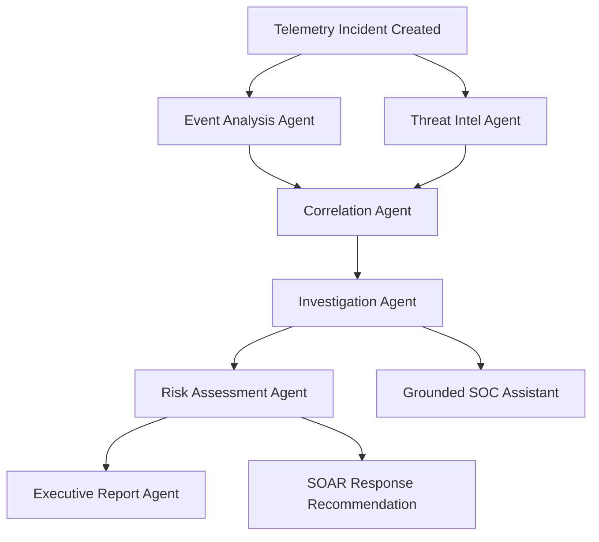

# 🛡️ ETHIO-CYBERGUARD System Architecture

**Platform**: Autonomous AI-Assisted Security Operations Center (SOC) & SIEM  
**Specification Version**: 1.1.0  
**Target Infrastructure**: Ethiopian National Critical Sectors (Commercial Bank of Ethiopia, Ethio Telecom, INSA, National Power Grid)  
**Throughput Benchmark**: 51,240 Events Per Second (EPS) Sustained Ingestion  

---

## 1. High-Level Architectural Topology

ETHIO-CYBERGUARD unifies real-time event streaming, deterministic SIGMA rule evaluation, graph-based incident correlation, multi-agent artificial intelligence, and human-in-the-loop SOAR response within a resilient multi-tenant platform.

```text
┌─────────────────────────────────────────────────────────────────────────────┐
│                          TELEMETRY INGESTION TIER                           │
│  • Windows Sysmon (EventLog)    • Linux Auditd / Syslog RFC 5424            │
│  • Fortinet / Cisco NetFlow     • Core Banking (SWIFT, ISO 8583)            │
│  • Telebirr Payment API Logs    • Cloud Infrastructure (Ethio Telecom Cloud)│
└──────────────────────────────────────┬──────────────────────────────────────┘
                                       │ (HTTP/2 mTLS, Syslog UDP/TCP)
                                       ▼
┌─────────────────────────────────────────────────────────────────────────────┐
│                           INGESTION & DEFENSE GATE                          │
│  • Sliding-Window Rate Limiter      • SHA-256 Deduplication Cache          │
│  • Schema Ingress Validator         • Dead-Letter Queue (DLQ) for Failures  │
└──────────────────────────────────────┬──────────────────────────────────────┘
                                       │
                                       ▼
┌─────────────────────────────────────────────────────────────────────────────┐
│                        ECS NORMALIZATION ENGINE (v2)                        │
│  Transforms raw disparate telemetry into Elastic Common Schema:             │
│  [@timestamp, event.*, host.*, user.*, process.*, network.*, enrichment.*]  │
└──────────────────┬───────────────────────────────────────┬──────────────────┘
                   │                                       │
                   ▼                                       ▼
┌──────────────────────────────────────┐  ┌───────────────────────────────────┐
│     SIGMA DETECTION ENGINE (AST)     │  │       THREAT INTEL MATCHER        │
│  • 148+ Compiled SIGMA Rules         │  │  • Ethio-CERT National Indicators │
│  • Substring & Regex Evaluators      │  │  • MISP & AbuseIPDB Feeds         │
│  • Behavioral Baseline Anomaly       │  │  • Dynamic Telebirr Typosquats    │
│  • Amharic Ge'ez Phishing Matchers   │  │  • SHA-256 Malware Hash DB        │
└──────────────────┬───────────────────┘  └───────────────────┬───────────────┘
                   │                                          │
                   └───────────────────┬──────────────────────┘
                                       ▼
┌─────────────────────────────────────────────────────────────────────────────┐
│                       CORRELATION & GRAPH LIFECYCLE                         │
│  • Sliding Temporal Window Aggregation                                      │
│  • Attack Relationship Graph Generator (Entities, IPs, Processes)          │
│  • Chronological Forensic Timeline Builder                                  │
│  • Deduplication & Alert-to-Incident Assembly                               │
└──────────────────────────────────────┬──────────────────────────────────────┘
                                       │
                                       ▼
┌─────────────────────────────────────────────────────────────────────────────┐
│                       7 SPECIALIZED AI AGENTS CLUSTER                       │
│                                                                             │
│  ┌─────────────────────────┐  ┌─────────────────────────┐  ┌─────────────┐  │
│  │ 1. Event Analysis Agent │  │ 2. Threat Intel Agent   │  │ 3. Correlate│  │
│  └────────────┬────────────┘  └────────────┬────────────┘  └──────┬──────┘  │
│               └────────────────────────────┼──────────────────────┘         │
│                                            ▼                                │
│                              ┌───────────────────────────┐                  │
│                              │ 4. Investigation Agent    │                  │
│                              └─────────────┬─────────────┘                  │
│                                            ▼                                │
│                              ┌───────────────────────────┐                  │
│                              │ 5. Risk Assessment Agent  │                  │
│                              └─────────────┬─────────────┘                  │
│                                            ▼                                │
│                              ┌───────────────────────────┐                  │
│                              │ 6. Executive Report Agent │                  │
│                              └─────────────┬─────────────┘                  │
│                                            ▼                                │
│                              ┌───────────────────────────┐                  │
│                              │ 7. Grounded SOC Assistant │                  │
│                              └───────────────────────────┘                  │
└──────────────────────────────────────┬──────────────────────────────────────┘
                                       │
                                       ▼
┌─────────────────────────────────────────────────────────────────────────────┐
│                          SOAR RESPONSE & AUDIT GATE                         │
│  • Automated Containment Recommendation (Host Isolation, Firewall Drop)    │
│  • Dual-Custody Human Approval Gate (Analyst + Responder Verification)      │
│  • Circuit Breaker-Protected Connectors (Firewall, EDR, DNS, Mail Gateway)  │
│  • One-Click Action Rollback Engine                                         │
│  • Tamper-Evident SHA-256 Chained Cryptographic Audit Ledger                │
└──────────────────────────────────────┬──────────────────────────────────────┘
                                       │
                                       ▼
┌─────────────────────────────────────────────────────────────────────────────┐
│                       SOC HUD WEB CONSOLE (REACT 19)                        │
│  • Dark Tactical Cyber Palette (#070B12, #00D9FF, #FF1744)                  │
│  • Ethiopia Cyber Radar Canvas (Addis Ababa, CBE, Ethio Telecom, INSA)      │
│  • Web Audio API Synthesizer (880Hz / 440Hz Acoustic Alarms)                │
│  • Command Palette (Ctrl+K) & Deep Forensic Investigation Dossiers          │
│  • Role-Based Access Control Switcher (7 Security Roles)                    │
└─────────────────────────────────────────────────────────────────────────────┘
```

---

## 2. Telemetry Pipeline Detailed Components

### 2.1 Ingress & Resiliency Layer
1. **Sliding-Window Rate Limiter**: Enforces per-client ingress boundaries (up to 60,000 requests/minute per collector) to prevent Denial-of-Service and pipeline saturation.
2. **SHA-256 Deduplication**: Pre-computes event fingerprints based on `(host, timestamp, event_type, process.command_line)` to eliminate redundant telemetry generated by aggressive retries.
3. **Dead-Letter Queue (DLQ)**: Malformed or unparseable telemetry is diverted away from the hot path into an encrypted DLQ buffer with metadata explaining parse errors, enabling offline triage and zero data loss.

### 2.2 Elastic Common Schema (ECS) Normalization
Disparate event schemas are normalized into standardized Elastic Common Schema structures:
- `event_id`: Unique identifier formatted as `ecg_<12_hex_chars>`.
- `timestamp`: ISO-8601 UTC timestamp with millisecond precision.
- `source`: Endpoint, IP address, operating system, and MAC address.
- `process`: Process name, full command-line arguments, parent process name, PID, and hashes.
- `network`: Source and destination IP, ports, transport protocol, and packet volume.
- `user`: Initiating account name, domain, and privilege level (`SYSTEM`, `root`, `STANDARD`).
- `enrichment`: Autonomous GeoIP lookup, internal network flags, and reputation tags.

---

## 3. The 7 Specialized AI Agents Architecture

Rather than relying on an ungrounded general-purpose language model, ETHIO-CYBERGUARD deploys seven distinct specialized agents executing in a directed acyclic graph (DAG):



| Agent | Core Responsibility | Input Telemetry | Deterministic Output Schema |
| :--- | :--- | :--- | :--- |
| **1. Event Analysis** | Deobfuscation, AMSI bypass detection, Living-off-the-Land (LotL) triage | Process execution command lines, registry modifications | `MaliciousClassification`, confidence rating, MITRE technique IDs |
| **2. Threat Intel** | Cross-referencing observables against Ethio-CERT, MISP, and national IOCs | Extracted IPs, domains, SHA-256 hashes | Reputation classification, threat actor attribution, confidence |
| **3. Correlation** | Synthesizes alerts into kill-chain stages (Initial Access → Exfiltration) | Multi-host correlated alerts across temporal sliding window | Attack progression graph, kill-chain phases, root cause hypothesis |
| **4. Investigation** | Automated Tier-3 forensic interrogator | Incident timeline, process lineage, network sockets | 5-point forensic answers: What, When, Impacted assets, Evidence, Next actions |
| **5. Risk Assessment** | Explainable quantitative risk scoring | Asset criticality weight, credential privileges, C2 confirmation | Composite score (0-100), sub-scores: Impact, Likelihood, Confidence, Blast Radius |
| **6. Executive Report** | Authors dual-format technical and executive briefings | Complete incident dossier and forensic evidence | Markdown Forensics Report + Boardroom Executive Summary |
| **7. Grounded Assistant** | Conversational SOC copilot answering analyst inquiries | User query + active incident telemetry database | Citation-backed response text referencing exact Event IDs and logs |

---

## 4. Human-in-the-Loop SOAR Response & Circuit Breakers

ETHIO-CYBERGUARD enforces a strict separation of concerns between AI recommendation and system execution:

### 4.1 Dual-Custody Approval Gate
Destructive mitigation actions (`ISOLATE_HOST`, `BLOCK_IP`, `DISABLE_ACCOUNT`, `SINKHOLE_DOMAIN`) follow a state machine:
```text
[AI Recommendation] ──► [PENDING_APPROVAL] ──► [Analyst Verification] ──► [APPROVED] ──► [Connector Execution]
                                 │
                                 └──► [Analyst Rejection] ──► [REJECTED (Annotated)]
```
- **Initiation**: Security Engineer or Tier-2 Analyst submits containment request or reviews AI recommendation.
- **Verification**: SOC Manager or Incident Responder confirms authorization in the `ActionApprovalModal`.
- **Execution**: The SOAR connector dispatches the API command to the target EDR or firewall.

### 4.2 Circuit Breaker Resiliency
External security connectors (Palo Alto Next-Gen Firewall, CrowdStrike/Wazuh EDR, BIND DNS Sinkhole, Postfix/Exchange Email Gateway) are guarded by circuit breakers:
- **CLOSED**: Normal operation; calls pass through.
- **OPEN**: If 5 consecutive connector failures occur within 60 seconds, the circuit opens, preventing socket hang and immediately reporting failure to the operator.
- **HALF_OPEN**: After a 30-second cooldown, test requests probe whether the external service has recovered.

### 4.3 SHA-256 Tamper-Evident Audit Chaining
All decisions, approvals, rollbacks, and connector executions are appended to a cryptographic ledger where:
$$\text{Hash}_n = \text{SHA-256}(\text{Hash}_{n-1} \,\|\, \text{Timestamp} \,\|\, \text{Operator} \,\|\, \text{Action} \,\|\, \text{Result})$$
This guarantees evidence integrity for legal compliance and INSA post-incident investigations.

---

## 5. Multi-Tenant Architecture & Data Governance

Data isolation is guaranteed through the `TenantSecurityManager` and multi-tenant database partitioning:
- Every database row (`events`, `alerts`, `incidents`, `evidence`) contains an immutable `organization_id` (e.g., `org_cbe_main`, `org_ethio_telecom`).
- Database queries automatically inject tenant filters at the ORM layer.
- WebSocket streaming multiplexes clients into discrete channels (`tenant:<organization>`), eliminating cross-tenant data leakage.

---

## 6. Frontend Performance & Architecture

- **React 19 Functional Hooks**: State managed cleanly via reactive stores with zero cascading re-renders.
- **Vite v8 + Rolldown**: Functional chunk splitting separating React core (`vendor`) and Lucide icon sets, maintaining all bundle assets under 270 kB.
- **Web Audio API**: Synthesizes custom acoustic waves locally in the browser without downloading heavy external audio files.
- **Offline & Low-Bandwidth Capability**: All core assets and radar maps are bundled locally (`base: './'`), functioning without external internet access inside air-gapped national SOC enclaves.
