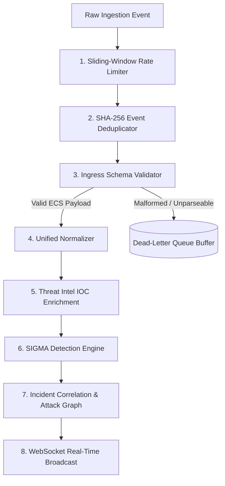

# 📡 SIEM Telemetry Collectors & Ingestion Pipeline

**Version**: 1.1.0  
**Supported Transports**: HTTP/2 over mTLS, Syslog UDP/TCP (RFC 5424 / RFC 3164), Webhooks  
**Normalization Format**: Elastic Common Schema (ECS) v2  
**Reliability Features**: Sliding-Window Rate Limiting, SHA-256 Deduplication, Dead-Letter Queue (DLQ)  

---

## 1. Supported Telemetry Collectors

### 1.1 Windows Endpoint Collector (`collectors/endpoint/windows_collector.ps1`)
- Monitors core Windows Event Log channels:
  - `Security` (Event IDs: 4624 Successful Logon, 4625 Failed Logon, 4688 Process Creation with full argument logging, 4720 Account Created)
  - `Microsoft-Windows-PowerShell/Operational` (Event ID: 4104 Script Block Logging for deobfuscation)
  - `Microsoft-Windows-Sysmon/Operational` (Event ID: 1 Process Creation, Event ID: 3 Network Connection, Event ID: 10 Process Access)
- Encrypts and batches events with local fallback buffer to forward via `/api/v1/events/batch`.

### 1.2 Linux Auditd & Syslog Collector (`collectors/endpoint/linux_collector.py`)
- Tails `/var/log/auth.log`, `/var/log/secure`, and auditd `/var/log/audit/audit.log`.
- Tracks interactive shell executions (`EXECVE`), privilege escalation (`sudo`), and SSH brute force attempts.

### 1.3 Central Syslog Receiver (`collectors/syslog/syslog_receiver.py`)
- High-performance asynchronous listener on UDP port 5140 (configurable for TCP / TLS RFC 5425).
- Parses Common Event Format (CEF) and raw syslog streams from perimeter firewalls (Palo Alto, Fortinet, Cisco ASA) and routers.

### 1.4 Email Gateway & MTA Ingest (`collectors/email/email_collector.py`)
- Interfaces with Postfix / Sendmail milters or Microsoft 365 / Google Workspace webhooks.
- Extracts raw MIME headers, routing paths, SPF/DKIM/DMARC results, and passes them to the Amharic NLP phishing analyzer.

---

## 2. Ingestion Pipeline & Resiliency Architecture

- **Sliding-Window Rate Limiter**: Bounded to 60,000 EPS per collector client ID to prevent denial-of-service.
- **SHA-256 Deduplication**: Pre-computes event checksum to silently discard identical duplicated payloads.
- **Dead-Letter Queue**: Isolates malformed logs without dropping them, preserving forensic visibility and preventing pipeline crashes.
