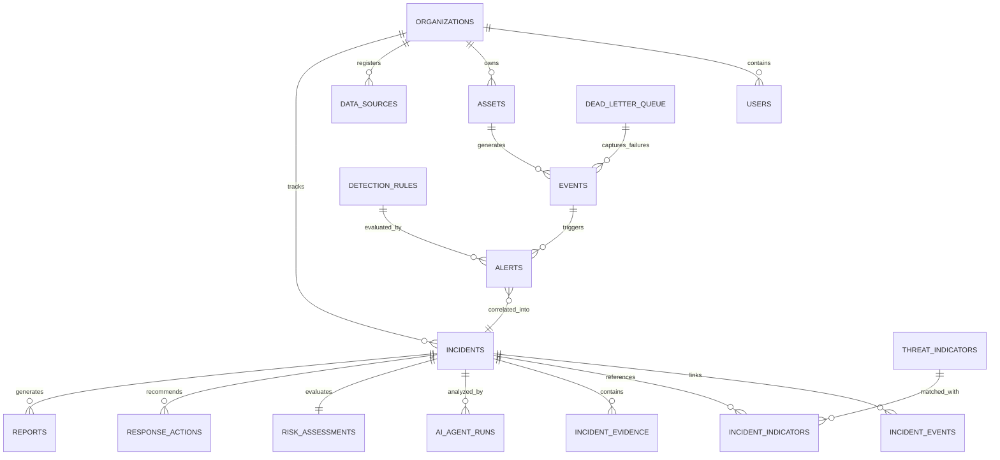

# 🗄️ ETHIO-CYBERGUARD Database Design & ERD

**Version**: 1.1.0  
**Engine**: PostgreSQL 16+ (with SQLAlchemy 2.0+ ORM / Alembic Migrations)  
**Security**: Row-Level Multi-Tenant Isolation, `uuid-ossp`, JSONB Telemetry Indexing, SHA-256 Chained Audit Hashes  

---

## 1. Relational Architecture & Entity Relationships

The schema is partitioned by `organization_id` to guarantee tenant isolation across enterprise and governmental sectors:

---

## 2. Core Entities & Tables

1. **organizations**: Multi-tenant tenants (`Commercial Bank of Ethiopia`, `Ethio Telecom`, `INSA`, `Regional Power Grids`).
2. **users**: RBAC accounts governed by 7 security roles (`SUPER_ADMIN`, `SOC_MANAGER`, `INCIDENT_RESPONDER`, `SECURITY_ANALYST`, `THREAT_HUNTER`, `AUDITOR`, `READ_ONLY`).
3. **assets**: Tracked network endpoints, servers, perimeter firewalls, and SCADA infrastructure.
4. **events**: Normalized Elastic Common Schema (ECS) event records with composite indices on `(organization_id, timestamp, event_type)`.
5. **dead_letter_queue**: Stores unparseable, malformed, or rejected telemetry events with diagnostic error reasons for post-mortem triage.
6. **threat_indicators**: Verified IOCs (IPs, domains, hashes, URLs) tagged with threat actor attributions, campaigns, and confidence levels.
7. **detection_rules**: Active SIGMA YAML and behavioral anomaly detection rule configurations.
8. **alerts**: Real-time detection signals generated by SIGMA AST rules or behavioral thresholds.
9. **incidents**: Central incident entity aggregating correlated alerts, forensic timelines, attack graphs, and status lifecycle.
10. **incident_evidence**: Cryptographically fingerprinted artifacts (memory dumps, PCAP files, scriptblocks) secured with SHA-256 checksums.
11. **ai_agent_runs**: Audit records of the 7 AI agents detailing execution timestamps, prompts, Pydantic structured outputs, and confidence scores.
12. **risk_assessments**: Quantified risk parameters (Impact, Likelihood, Exposure, Blast Radius, Composite Score 0–100).
13. **response_actions**: Containment recommendations governed by dual-custody states (`PENDING_APPROVAL`, `APPROVED`, `REJECTED`, `EXPIRED`, `ROLLED_BACK`).
14. **audit_logs**: Immutable, chronological ledger secured by SHA-256 hash chaining:
    $$\text{Hash}_n = \text{SHA-256}\left(\text{Hash}_{n-1} \,\|\, \text{Timestamp} \,\|\, \text{Operator} \,\|\, \text{Action} \,\|\, \text{Target} \,\|\, \text{Outcome}\right)$$
