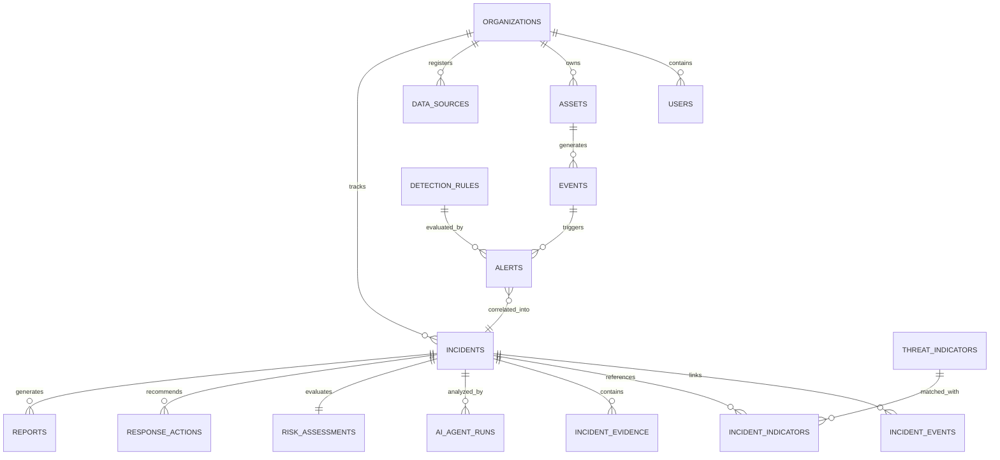

# 🗄️ ETHIO-CYBERGUARD Database Design & ERD

## Relational Architecture
The database is built on PostgreSQL with JSONB columns for flexible telemetry and `uuid-ossp` for distributed identification.

---

## Core Entities

1. **organizations**: Multi-tenant partitioning for educational, enterprise, and governmental bodies.
2. **users**: RBAC accounts (`SUPER_ADMIN`, `SOC_MANAGER`, `SECURITY_ANALYST`, `VIEWER`).
3. **assets**: Tracked network endpoints, servers, firewalls, and critical infrastructure.
4. **events**: Normalized standard security event records with indexed timestamps and IP addresses.
5. **threat_indicators**: Verified IOCs (IPs, domains, hashes) tagged with threat actors and confidence levels.
6. **detection_rules**: SIGMA and behavioral anomaly rule configurations.
7. **alerts**: Real-time signals generated by rule or anomaly evaluations.
8. **incidents**: Central SOC entity aggregating correlated alerts, evidence, attack graphs, and status.
9. **incident_evidence**: Cryptographically fingerprinted artifacts (log snippets, memory dumps, PCAP).
10. **ai_agent_runs**: Audit trail of AI agent inferences, prompts, structured outputs, and confidence ratings.
11. **risk_assessments**: Quantified impact, likelihood, exposure, and composite score (0-100).
12. **response_actions**: Containment recommendations governed by human approval states (`PENDING_APPROVAL`, `APPROVED`, `REJECTED`, `EXECUTED`).
13. **reports**: Publication-ready technical forensics and executive briefings.
14. **audit_logs**: Immutable chronological ledger of all analyst decisions and system activities.
