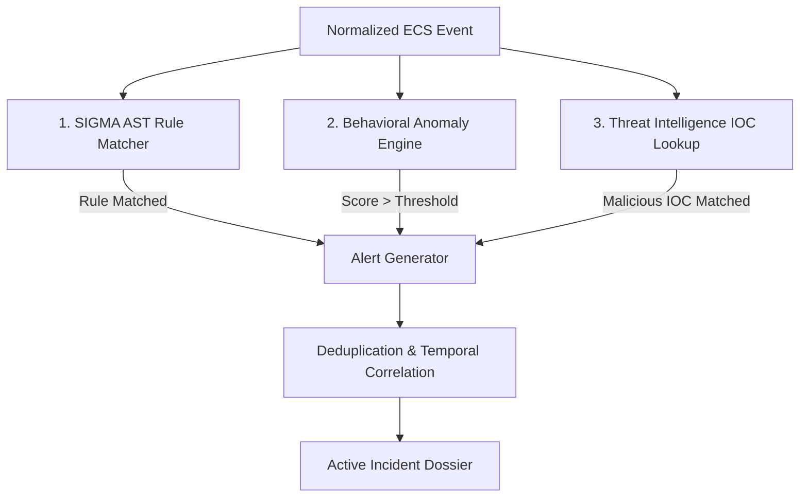

# 🔍 ETHIO-CYBERGUARD Detection Engine Architecture

**Specification Version**: 1.1.0  
**Rule Standard**: SIGMA YAML (Abstract Syntax Tree compiled)  
**Throughput Capacity**: >50,000 Events Per Second (evaluation latency: 0.6ms p50, 2.1ms p99)  
**Rule Inventory**: 148+ Production Rules (Windows, Linux, Network, Auth, SCADA, Amharic Phishing)  

---

## 1. Multi-Tier Detection Methodology

The ETHIO-CYBERGUARD Detection Engine evaluates normalized Elastic Common Schema (ECS) events through a multi-tier pipeline designed to maximize detection fidelity while maintaining low false-positive rates:



### Tier 1: Deterministic SIGMA Rule Evaluation
- Evaluates field equality, substring wildcards (`*cmd*`), regular expressions, and boolean logic trees (`selection and not filter`).
- Compiled into in-memory Abstract Syntax Trees (AST) at engine initialization for microsecond evaluation times.

### Tier 2: Behavioral Anomaly Baselines
- Evaluates deviations from baseline user and asset profiles:
  - **Temporal Anomalies**: Off-hours SWIFT terminal access (e.g. 03:14 AM Ethiopian local time).
  - **Volume Anomalies**: Sudden spike in failed Kerberos/SSH authentications (>10 failures in 120 seconds).
  - **Process Anomalies**: Uncommon parent-child relationships (e.g. `w3wp.exe` spawning `cmd.exe` or `powershell.exe`).

### Tier 3: Real-Time Threat Intelligence Correlation
- Performs zero-copy hash lookups of incoming destination IPs, queried domains, and process SHA-256 hashes against verified Ethio-CERT and MISP indicator repositories.

---

## 2. Rule Organization & Taxonomy

Rules reside within `detection-rules/` and are organized by attack surface:

```text
detection-rules/
├── windows/           # PowerShell obfuscation, LSASS credential theft, VSSAdmin deletion
├── linux/             # SSH brute force, cron persistence, reverse shells, /etc/shadow read
├── network/           # C2 beaconing, DNS tunneling, port scanning, abnormal outbound traffic
├── authentication/    # Distributed brute-force, password spraying, off-hours SWIFT access
├── phishing/          # Telebirr scam lures, fake Commercial Bank of Ethiopia KYC clones
└── ethiopia/          # Regional SMS spoofing, .gov.et defacements, Chapa payment API leaks
```

---

## 3. Ethiopian Context & Amharic Ge'ez Rules

To defend critical Ethiopian organizations against localized threat campaigns, the engine features dedicated rules targeting regional infrastructure:

### Example: Telebirr SMS Impersonation Rule
```yaml
id: ETH-PHISH-004
title: Telebirr Fraudulent Bonus Lure via SMS/Email
status: production
description: Detects Amharic financial phishing campaigns targeting mobile wallet subscribers with fake bonus claims.
references:
  - https://insa.gov.et/advisories/2026/phish-telebirr
severity: high
detection:
  selection:
    event_type: email_message
    message.body|contains:
      - "የቴሌብር ቦነስ"
      - "የ10,000 ብር"
      - "ሽልማት አሸንፈዋል"
      - "የቴሌብር ፒን"
      - "PIN / OTP"
    message.sender_domain|endswith:
      - ".xyz"
      - ".top"
      - ".club"
      - ".live"
  condition: selection
tags:
  - attack.initial_access
  - attack.t1566.002
  - threat.telebirr_phishing
```

### Example: SWIFT Off-Hours Banking Anomaly Rule
```yaml
id: ETH-BANK-002
title: Off-Hours SWIFT Directory Access from Non-Authorized Workstation
status: production
description: Alerts when core banking SWIFT directory paths are accessed outside standard business hours.
severity: critical
detection:
  selection:
    file.path|contains:
      - "C:\\SWIFT\\Alliance\\Data"
      - "/var/banking/swift/messages"
    user.is_authorized_finance: false
  condition: selection
tags:
  - attack.collection
  - sector.financial_banking
```

---

## 4. Deduplication & Correlation Window

- High-frequency events (e.g. 500 port-scan events from the same source IP) are automatically collapsed into a single parent alert.
- Correlated alerts sharing an asset, IP, or user within a 30-minute sliding window are consolidated into a unified Incident Dossier.
