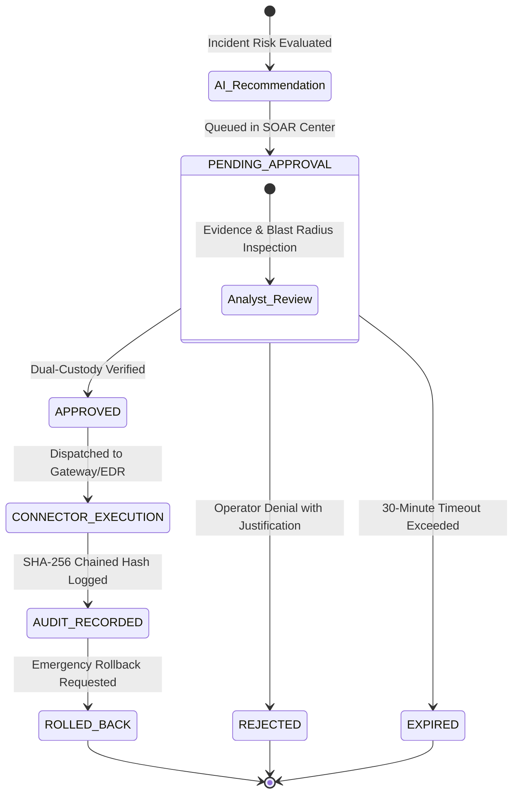

# 🚨 Incident Response & SOAR Playbook Architecture

**Specification Version**: 1.1.0  
**Core Governance**: Dual-Custody Human-in-the-Loop Approval, Circuit Breaker Connectors, Tamper-Evident SHA-256 Audit Log  

---

## 1. Dual-Custody Human-in-the-Loop Philosophy

ETHIO-CYBERGUARD rejects autonomous, unverified destructive containment actions by automated algorithms or language models. All containment operations follow an enforceable state machine governed by role authorization:



---

## 2. Standard SOAR Playbooks

### Playbook 1: Host Network Isolation (`ISOLATE_HOST`)
- **Target**: Compromised Windows/Linux endpoints showing active C2 beaconing or credential theft.
- **Mechanism**: Commands endpoint agent/EDR to drop all network traffic except an encrypted, authenticated TLS tunnel back to the SOC management server.
- **Rollback**: Restores original network interface routing and firewall profiles upon incident resolution.

### Playbook 2: Perimeter Firewall IP Drop (`BLOCK_IP`)
- **Target**: External C2 servers, brute-force source IPs, or phishing hosting nodes.
- **Mechanism**: Pushes an immediate rule to perimeter firewalls (Palo Alto, Fortinet, pfSense) dropping all ingress and egress packets for the target IP address.
- **Dry-Run Mode**: Allows operators to test rule propagation and verify no critical banking or partner infrastructure is unintentionally blocked.

### Playbook 3: Identity & Session Revocation (`DISABLE_ACCOUNT`)
- **Target**: Compromised domain user or service accounts.
- **Mechanism**: Invalidates active Kerberos tickets, revokes OAuth/OIDC tokens, and suspends account logon rights across Active Directory / Microsoft Entra.

### Playbook 4: Domain Sinkhole & Registrar Takedown (`TAKEDOWN_DOMAIN`)
- **Target**: Typosquatted fraudulent domains and credential-harvesting web applications.
- **Mechanism**: Diverts internal DNS resolver queries to a sinkhole IP address and generates standardized abuse notices to registrar authorities.

---

## 3. Circuit Breaker Resiliency for Connectors

External security appliances can experience downtime or network partitions during large-scale cyber incidents. To avoid freezing the SOC orchestrator, all outbound connector calls are wrapped in a **Circuit Breaker**:

```text
                  ┌──────────────┐
                  │    CLOSED    │  (Normal Operation: Requests pass through)
                  └──────┬───────┘
                         │ 5 Consecutive Failures
                         ▼
                  ┌──────────────┐
                  │     OPEN     │  (Fails immediately: 30s Cooldown)
                  └──────┬───────┘
                         │ Cooldown Expires
                         ▼
                  ┌──────────────┐
                  │  HALF_OPEN   │  (Probing: 1 Request tested)
                  └──────────────┘
                    │          │
         Success ───┘          └─── Failure (Re-opens)
```

---

## 4. Cryptographically Chained Audit Ledger

Every response action, analyst sign-off, operator rejection, or rollback is recorded in an immutable, append-only audit ledger. Each entry includes:
$$\text{Hash}_n = \text{SHA-256}\left(\text{Hash}_{n-1} \,\|\, \text{Timestamp} \,\|\, \text{Operator} \,\|\, \text{Action} \,\|\, \text{Target} \,\|\, \text{Result}\right)$$

This mathematical chaining prevents retroactive alteration of incident response records, fulfilling national evidentiary standards for INSA and judicial proceedings.
