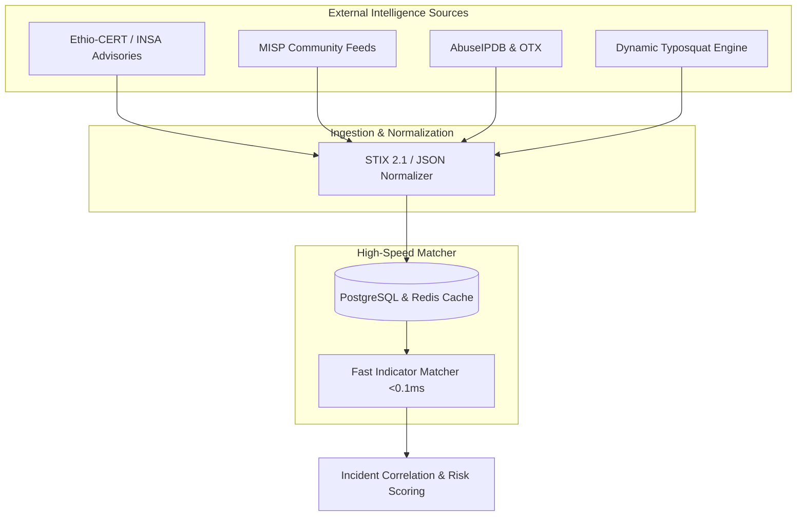

# 🌐 Threat Intelligence Architecture & National Feeds

**Specification Version**: 1.1.0  
**National Context**: Ethio-CERT / INSA Feeds, Telebirr & CBE Brand Defense  
**Supported Standards**: STIX 2.1, MISP JSON, RFC 7970 (IODEF), CSV/Plaintext Indicators  

---

## 1. National & Global Threat Intelligence Feeds

ETHIO-CYBERGUARD bridges local national cyber defense entities with global threat intelligence repositories:

### Feed Repositories:
1. **National Feed (Ethio-CERT / INSA)**: Official government threat advisories, malicious state-sponsored actor IPs, and compromised domestic ranges.
2. **Global Enterprise Feeds (MISP / AlienVault OTX / AbuseIPDB)**: Global ransomware C2s, Cobalt Strike team servers, and bulletproof hosting infrastructure.
3. **Dynamic Brand Defense Engine (openSquat / Levenshtein)**: Real-time generation of lookalike and homoglyph domains impersonating critical Ethiopian institutions:
   - `telebirr.et` $\longrightarrow$ `teleb1rr-bonus.xyz`, `telebirr-login.top`
   - `cbe.com.et` $\longrightarrow$ `cbe-online-banking.net`, `cbe-ethiopia.org`

---

## 2. Supported Indicator Formats (IOCs)

| Indicator Type | Description | Example Observable | Matching Method |
| :--- | :--- | :--- | :--- |
| **IPv4 / IPv6** | Adversary C2 servers, scanning proxies, brute-force exit nodes | `185.220.101.5` | Exact match + CIDR subnet index |
| **Domain / FQDN** | Phishing portals, dynamic DNS, typosquatted brand sites | `telebirr-bonus.xyz` | Exact match + sub-domain tree search |
| **File Hash (SHA-256)** | Malware binaries, Cobalt Strike beacons, webshells | `e3b0c44298fc1c149...` | Exact cryptographic checksum |
| **URL** | Credential harvest forms, weaponized payload links | `http://196.188.99.12/claim` | Normalized URL path & IP-in-URL parser |

---

## 3. High-Speed In-Memory Enrichment

During live telemetry normalization, extracted network destinations and file hashes are enriched against the IOC store:
- **Lookup Latency**: Sub-millisecond ($<0.1\,\text{ms}$) via indexed in-memory dictionaries and Redis cache.
- **Enrichment Data**: Confidence score ($0\dots 100\%$), threat actor attribution, active campaign tag, and recommended SOAR playbook.
- Alerts enriched with verified high-confidence indicators automatically receive risk score multipliers and high-priority triage placement.
